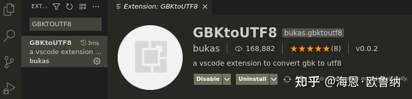
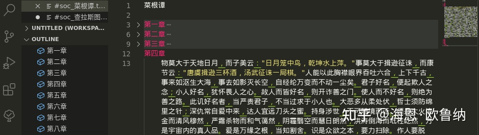
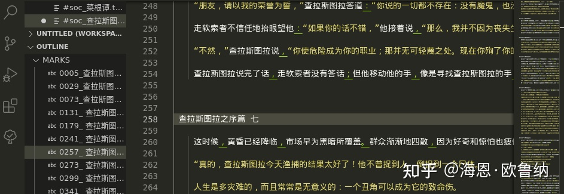
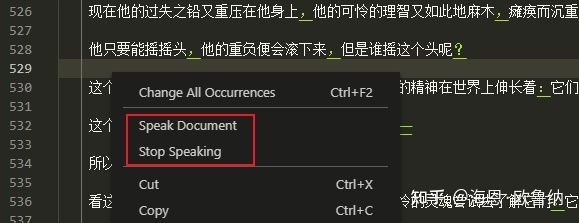
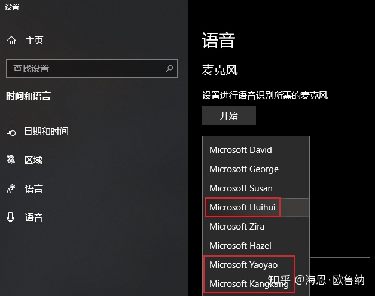
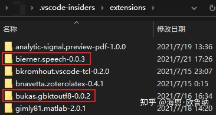
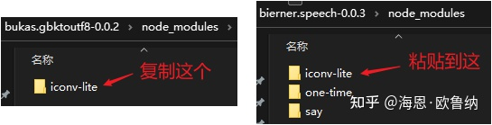
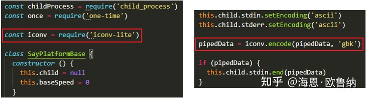

# Win10PC桌面端中文阅读解决方案

## 引言
在当前时代，手机阅读已经成为主流，各种读书听书app层出不穷。与此同时，PC桌面端被各家资本所抛弃。而对于一些anti-app党，PC端过时的读书软件根本无法满足的需求，因此，我们需要自己来解决这个问题。
首先明确一下目标，即我们需要对最基本的txt格式实现如下目标：
- 文本显示：能够打开很大的文件
- 编码转换：能够吃下任意中文编码
- 目录显示：能够像APP一样随意跳转章节
- 目录折叠：能像写代码一样按标题折叠每个章节，这也可以代替上一个“目录显示”功能
- 语音朗读：当需要闭目养神的时候，解放一下眼睛
好了，开始。

## 文本显示
作为一切的基本，我们选择VS Code (Insiders版)作为基本框架。若有爱好者也可以尝试Atom，考虑到sublime对于目录侧边栏支持比较弱，相应插件也少，其他的小众编辑器估计更加不行。来到VS Code Insiders，下载安装即可。

编码转换

在VS Code中，我们会发现，很多文本打开是乱码。这是因为，很多中文txt文档都是ANSI/GBK编码，而VS Code是基于UTF-8编码。因此，一个插件解决问题：GBKtoUTF8，作者bukas，五星好评。并且这个插件还有额外的好处，此处暂且伏笔。

## 目录显示、目录折叠
这两个功能放在一起，需要安装两个插件，分别为
- Txt Syntax 这个用于文本语法高亮、章节跳转、章节折叠
- txt book outline 这个用于更强的章节跳转

如果对于格式完美的文档，Txt Syntax就够。但对于很多文档的结构非常凌乱，Txt Syntax识别不太给力，就需要后者进行弥补。不过本人觉得尽量还是使之适应Txt Syntax，毕竟章节折叠可太香了。见下图：

由Txt Syntax读取的目录，以及完美折叠示例

由 txt book outline 读取的目录，包含行号，可跳转，无法折叠

## 语音朗读
语音TTS(Text-To-Speech)方案是本文重点。理论上可以在Win10自带的朗读员Huihui支持下完美运行（尚未在多台机器进行调试，如有问题欢迎反馈）。
具体分为如下几步：1.安装插件VSCode Speech，2.修改复制文件夹，3.修改两行脚本。

1. 安装[VSCode Speech](https://link.zhihu.com/?target=https%3A//marketplace.visualstudio.com/items%3FitemName%3Dbierner.speech)，右键测试，能够听到……嗯，乱码。（如果无声或者英语口音请重新设置，建议设置最基本的Huihui做中文测试）

2. 右键测试VSCode Speech发声
3. 

中文语音为Huihui(女)，Yaoyao(女)和Kangkang(男)

2. 为了修复这个乱码，我们需要找到VS Code Insiders的插件文件夹，一般在用户文件夹形如“C:\Users\XXX\.vscode-insiders\extensions\”。然后就要用到之前的GBKtoUTF8插件。首先进入“bukas.gbktoutf8-0.0.2\node_modules\”将“iconv-lite”文件夹复制，粘贴到“bierner.speech-0.0.3\node_modules\”下。

找到插件文件夹

将GBKtoUTF8下的iconv-lite文件夹复制到VSCode Speech文件夹下

3. 最后一步，让VS Code Speech使用iconv-lite进行编码转换。打开“bierner.speech-0.0.3\node_modules\say\platform\base.js”，加入两行代码，如下图所示
- const iconv = require('iconv-lite')
- pipedData = iconv.encode(pipedData, 'gbk') //注意，本段代码对应的前后文共有两处，我们用于朗读只需改speak函数中的那个，另一个export函数是用于生成wav的。

加入两行代码进行编码转换

重新启动VS Code，再次使用VS Code Speech进行中文朗读，应该已经能正确发声了。

## 结语
本文开篇的目的，至此已经全部实现了，还请尽情享受PC桌面端自由阅读的快乐。

另外，需要补充的是，Linux因为缺少原生中文TTS发声支持，因此留待各位高手进一步挖掘。而对Mac系统，本人缺少测试条件故未进行。
本文TTS的问题，归根到底在于中文的GBK编码是二等公民。希望有一天，我们能够让中文成为计算机世界，乃至现实世界的一级标准。

## 附录
说明一下TTS问题处理的原因：
- 首先，VSCode Speech是一个很好的插件，其调用了Say.js这个基于Node.js的软件包，通过系统自带的TTS发声，设计毫无问题。
- 其次，Say.js这个包本身也没有问题，但是在其github页面上，有各种语言的用户反馈表示对自己的语言支持不好。
- 最后，经查发现，一切的根源在与Node.js本身对于文本编码支持有问题，对此修复即可。
本文的操作，本质上是通过iconv-lite将错误识别的GBK编码进行强制发送，从而让系统TTS得到正确的文本。对插件重新编译iconv-lite是一个复杂的工作，因此我们进行了小小的投梁换柱，把GBKtoUTF8的iconv-lite包借来使用了一下，就可以让Say.js得以发送出正确的编码。
由于这个问题本质在于Node.js，虽然可以在Say.js中进行校准，但看到其他语言也有编码问题，而且各自处理方案也不一而同，估计作者不太会对此进行修复。因此本人只是fork了一个repository留存，供中文用户参考。
